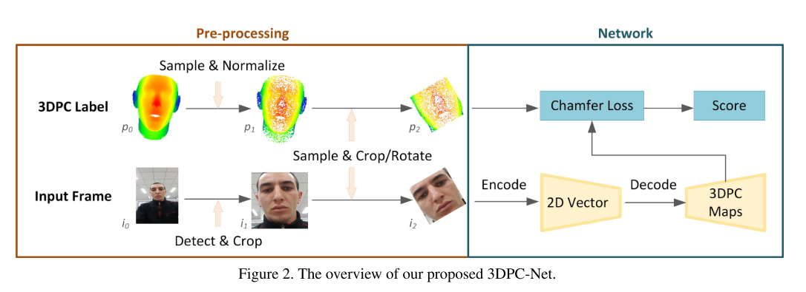

# 3DPC-Net: 3D Point Cloud Network for Face Anti-spoofing
This is a non official implementation of the paper 3DPC-Net: 3D Point Cloud Network for Face Anti-spoofing <br>
Paper Authors: Li; Xuan; Wan, Jun; Jin, Yi; Liu, Ajian; Guo, Guodong; Li, Stan Z. <br>
Journal: IEEE/IAPR International Joint Conference on Biometrics <br>
Year: 2020 <br>
Source: http://www.cbsr.ia.ac.cn/users/jwan/papers/IJB2020-3DPCNet.pdf <br>




# Introduction

This work is a non official implementation of 3DPC-Net. The code is prepared to train on Dataset OULU protocol 1. If you want to train on other OULU protocols you should modify `get_label` inside `tools/FASDATASET.py`. <br>

Unfortunately, after several tests we couldn't reproduce paper results on OULU protocol 1. We didn't find a proper way to do the Preprocess pipeline: Downsample -> Normalization -> Data Augmentation (not necessarily in this order). On normalization step, we tried many ways to normalize point cloud data but none of them seems to produce correct points to classify images in live/spoof, i.e. the score (mean of points on 3 axis) is 0.5 for both labels.

Welcome for valuable issues, PRs and discussions!

# Getting Started
## Dependecies
First clone de repository
```bash
git clone https://gitlab.com/cyberlabsai/ml/cv/3dpc-net.git
cd 3dpc_net
```
After that, download all the required dependencies.<br>
Important Note: the version on Python for running this repository is ` 3.6.9 ` and CUDA ` 10.1 `. <br> 
For other CUDA and python versions you'll need to install appropiate libs version, like pytorch3d and torch, otherwise it will raise errors.
```bash
pip3 install "torch==1.7.0+cu101" "torchvision==0.8.1+cu101" -f https://download.pytorch.org/whl/torch_stable.html
pip3 install pytorch3d -f https://dl.fbaipublicfiles.com/pytorch3d/packaging/wheels/py36_cu101_pyt170/download.html
pip3 install -r requirements.txt
```

## Preprocess
1. The data used to train this model is the OULU dataset. In order to train it properly you need to extract the frames from the datasets. Since the OULU is heavy, this process can take some time to conclude, so be pacient. 

```bash
cd preprocess
python3 video_to_files.py --protocol 3 --protocols-folder OULU/Protocols --subset Train  --processed-folder OULU_ExtractedFrames  --train-folder OULU/Train_files
```

  After extract frames from OULU folder you'll have a folder called OULU_ExtractedFrames in this structure:

  ```bash
  OULU_ExtractedFrames/
    Protocol_i/ # i in {1, 2, 3, 4}
        Subset/ # {Train, Dev, Test}
            Live/ Print_Attack/ Video_Replay_Attack/
                PersonID_NumFrame.jpg # 1_1_01_1_0.jpg, 1_1_01_1_1.jpg, 1_1_01_1_3.jpg ...
  ```


2. Now you need to generate point cloud labels from extracted frames. Labels are generated per protocol and division. Set onnx flag to speed up inference of your DFA model.

```bash
cd ../retinaface
make
cd ..
python3 gen_labels.py --save_path OULU_labels -dp OULU_ExtractedFrames/ --protocol 3 --division 2 --subset Train --onnx
```

After to generate labels you'll have a folder in this structure containing cropped images and point cloud labels:
  ```bash
  OULU_labels/
    Protocol_i/ # i in {1, 2, 3, 4}
        Subset/ # {Train, Dev, Test}
            PersonID_NumFrame.jpg # 1_1_01_1_0.jpg, 1_1_01_1_1.jpg, 1_1_01_1_3.jpg ...
            PersonID_NumFrame.npy # 1_1_01_1_0.npy, 1_1_01_1_1.npy, 1_1_01_1_3.npy ...
  ```
This new folder will be used to train your model

## Train 
All parameters for training can be found at:  ```config/DPC3_NET_config.yaml```. <br>
You can also get the pretrained model at: ```experiments/exp_1 ```  <br>
In order to train the model simply run:     <br>
```bash
python3 Train.py --exp_name EXPERIMENT_NAME --logs_path LOGS_PATH --cfg CFG_FILE.yaml --load_model CONTINUE_TRAIN_MODEL_PATH
```

## Test
If you want to run a Benchmark on OULU Test set, for example, run:
```bash
python3 Test.py --exp_folder EXPERIMENT_PATH_FOLDER --load_model MODEL_PATH 
```
Otherwise, It can be done either with a single picture:
```bash
python3 Inference.py --img IMG_PATH --model MODEL_PATH
```
## Run on Docker
Docker containers are virtual machines that make easier to deploy an application, without having to deal with different packages versions.
If you don't have docker installed : ``` sudo apt-get install docker ```   <br>
To build the docker run: 
```bash
sudo docker build -t dpc3_net . 
```
Once it is built, run the docker with the ``` PATH ``` for the training dataset

```bash
sudo docker run -ti --gpus all --shm-size=31G --ipc=host -v /3dpc_folder*:/home --name dcp3-net dpc3_net bash  
```
*The mapped folder on docker should contain Dataset folder in order to train in docker.

Don't forget to change the config file before running the achiteture with:
```bash
python3.6 Train.py --exp_name EXPERIMENT_NAME --logs_path LOGS_PATH --cfg CFG_FILE.yaml --load_model CONTINUE_TRAIN_MODEL_PATH
```

# Acknowledgement

- We used [RetinaFace](https://github.com/deepinsight/insightface/tree/master/detection/retinaface) face detector from InsightFace.

- Training code was adapted from [CDCN-Face-Anti-Spoofing.pytorch](https://github.com/voqtuyen/CDCN-Face-Anti-Spoofing.pytorch)

- Point Cloud labels were generated with [3DDFA_V2](https://github.com/cleardusk/3DDFA_V2)
